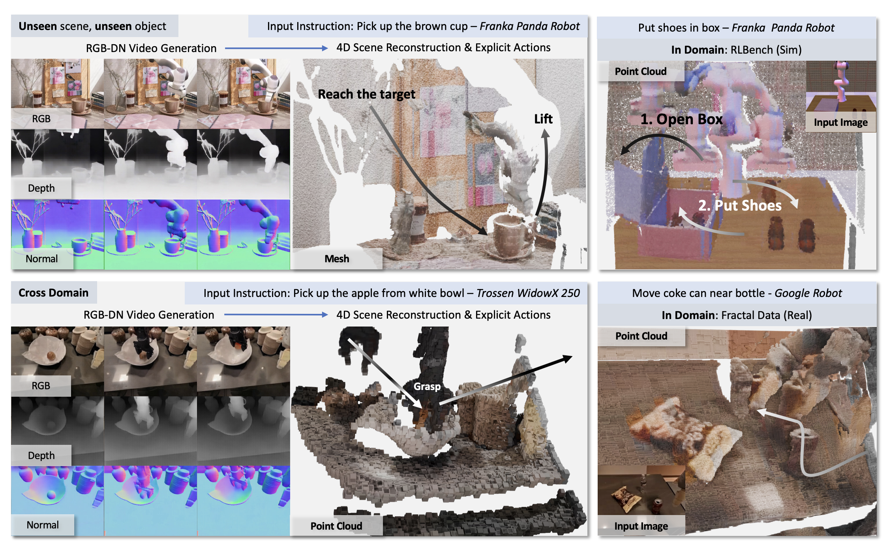

<p align="center">
  <h1 align="center">TesserAct: Learning 4D Embodied World Models</h1>
  <p align="center">
    arXiv 2025
  </p>
  <p align="center">
    <a href="https://haoyuzhen.com">Haoyu Zhen*</a>,
    <a href="https://qiaosun22.github.io/">Qiao Sun*</a>,
    <a href="https://icefoxzhx.github.io/">Hongxin Zhang</a>,
    <a href="https://senfu.github.io/">Junyan Li</a>,
    <a href="https://rainbow979.github.io/">Siyuan Zhou</a>,
    <a href="https://yilundu.github.io/">Yilun Du</a>,
    <a href="https://people.csail.mit.edu/ganchuang">Chuang Gan</a>
  </p>
  <p align="center">
    <a href="https://arxiv.org/abs/2504.20995">
      
    </a>
    <a href='https://tesseractworld.github.io' style='padding-left: 0.5rem;'>
      
    </a>
    <a href='https://huggingface.co/anyeZHY/tesseract' style='padding-left: 0.5rem;'>
      
    </a>
  </p>
</p>

We propose TesserAct, the 4D Embodied World Model, which takes input images and text instruction to generate RGB, depth,
and normal videos, reconstructing a 4D scene and predicting actions.

<p align="center">
    
</p>

<br>

<!-- TABLE OF CONTENTS -->
<details open="open" style='padding: 10px; border-radius:5px 30px 30px 5px; border-style: solid; border-width: 1px;'>
  <summary>Tabel of Contents</summary>
  <ol>
    <li>
      <a href="#installation">Installation</a>
    </li>
    <li>
      <a href="#training">Training</a>
    </li>
    <li>
      <a href="#inference">Inference</a>
    </li>
    <li>
      <a href="#citation">Citation</a>
    </li>
    <li>
      <a href="#acknowledgement">Acknowledgement</a>
    </li>
  </ol>
</details>

## News
- [2025-04] We have released the inference code and TesserAct-v0.1 model weights!

## Installation
Create a conda environment and install the required packages:
```bash
conda create -n tesseract python=3.9
conda activate tesseract
pip install -r requirements.txt

git clone https://github.com/UMass-Embodied-AGI/TesserAct.git
cd TesserAct
pip install -e .
```

## Training
We plan to release the training code in about two weeks. Our code is based on early versions of [Finetrainers](https://github.com/a-r-r-o-w/finetrainers).

> [!NOTE]
> We don't have a clear plan for releasing the whole dataset yet, because depth data is usually stored as floats, which takes up a lot of space and makes uploading to Hugging Face very difficult. However, we will provide scripts later on to show how to prepare the data.

## Inference

Now TesserAct includes following models. The names of the models are in the format of `anyeZHY/tesseract/` (huggingface repo name) + `<model_name>_<version>_<modality>_<training_method>`. In `<version>`, postfix `p` indicates the model is production-ready and `e` means the model is experimental. We will keep updating the model weights and scaling the dataset to improve the performance of the models.
```
anyeZHY/tesseract/tesseract_v01e_rgbdn_sft
anyeZHY/tesseract/tesseract_v01e_rgb_lora
```

> [!IMPORTANT] 
> It is recommended to read [USAGE.MD](doc/usage.md) for more details **before running the inference code on your own data.**
We provide a guide on how to prepare inputs, such as text prompt. We also analyze the model's limitations and performance, including:
>
> - Tasks that the model can reliably accomplish.
>
> - Tasks that are achievable but with certain success rates. In the future, this may be improved by using techniques like test-time scaling.
>
> - Tasks that are currently beyond the model's capabilities.

You can run the inference code with the following command (Optional flags: `--memory_efficient`).
```bash
python inference/inference_rgbdn_sft.py \
  --weights_path anyeZHY/tesseract/tesseract_v01e_rgbdn_sft \
  --image_path asset/images/fruit_vangogh.png \
  --prompt "pick up the apple google robot"
```

This inference code will generate a video of the google robot picking up the apple in the Van Gogh Painting.
<p align="center">
    
</p>

You may find output videos in the `results` folder.
Note: when we test the model on another server, the results are exactly the same as the ones we uploaded to github.
So if you find they are different and get unexpected results like noisy videos, please check your environment and the version of the packages you are using.

<p align="center">
    
</p>

> [!WARNING]
> Because RT1 and Bridge normal data is generated by [Temporal Marigold](https://huggingface.co/docs/diffusers/en/using-diffusers/marigold_usage#frame-by-frame-video-processing-with-temporal-consistency), sometimes normal outputs are not perfect. We are working on improving the data using [NormalCrafter](https://github.com/Binyr/NormalCrafter).

Below is a list of TODOs for the inference part.
- [ ] LoRA inference code
- [ ] Blender rendering code (check package [PyBlend](https://github.com/anyeZHY/PyBlend)!)
- [ ] Normal Integration

## Citation
If you find our work useful, please consider citing:
```bibtex
@article{zhen2025tesseract,
  title={TesserAct: Learning 4D Embodied World Models}, 
  author={Haoyu Zhen and Qiao Sun and Hongxin Zhang and Junyan Li and Siyuan Zhou and Yilun Du and Chuang Gan},
  year={2025},
  eprint={2504.20995},
  archivePrefix={arXiv},
  primaryClass={cs.CV},
  url={https://arxiv.org/abs/2504.20995}, 
}
```

## Acknowledgements
We would like to thank the following works for their code and models:
- Training: [CogVideo](https://github.com/THUDM/CogVideo), [Finetrainers](https://github.com/a-r-r-o-w/finetrainers) and [VideoX-Fun](https://github.com/aigc-apps/VideoX-Fun)
- Data generation: [RollingDepth](https://github.com/prs-eth/rollingdepth), [Marigold](https://github.com/prs-eth/Marigold) and [DSINE](https://github.com/baegwangbin/DSINE)
- Datasets: [OpenX](https://robotics-transformer-x.github.io/), [RLBench](https://github.com/stepjam/RLBench), [Hiveformer](https://github.com/vlc-robot/hiveformer) and [Colosseum](https://github.com/robot-colosseum/robot-colosseum)
- Why normals: [BiNI](https://github.com/xucao-42/NormalIntegration), [ICON](https://github.com/YuliangXiu/ICON), [StableNormal](https://github.com/Stable-X/StableNormal) and [NormalCrafter](https://github.com/Binyr/NormalCrafter)

We are extremely grateful to Pengxiao Han for assistance with the baseline code, and to Yuncong Yang, Sunli Chen,
Jiaben Chen, Zeyuan Yang, Zixin Wang, Lixing Fang, and many other friends in our [Embodied AGI Lab](https://embodied-agi.cs.umass.edu/)
for their helpful feedback and insightful discussions.